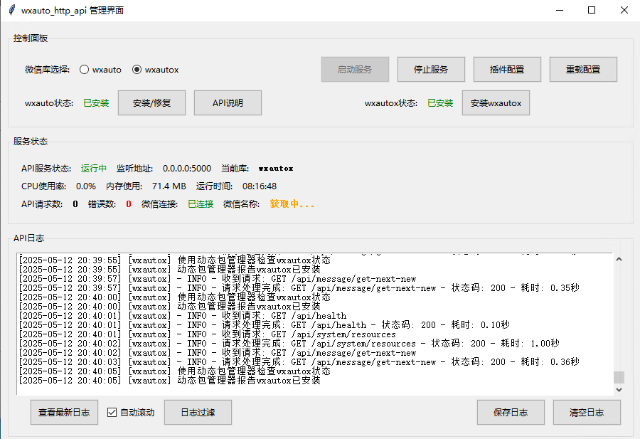
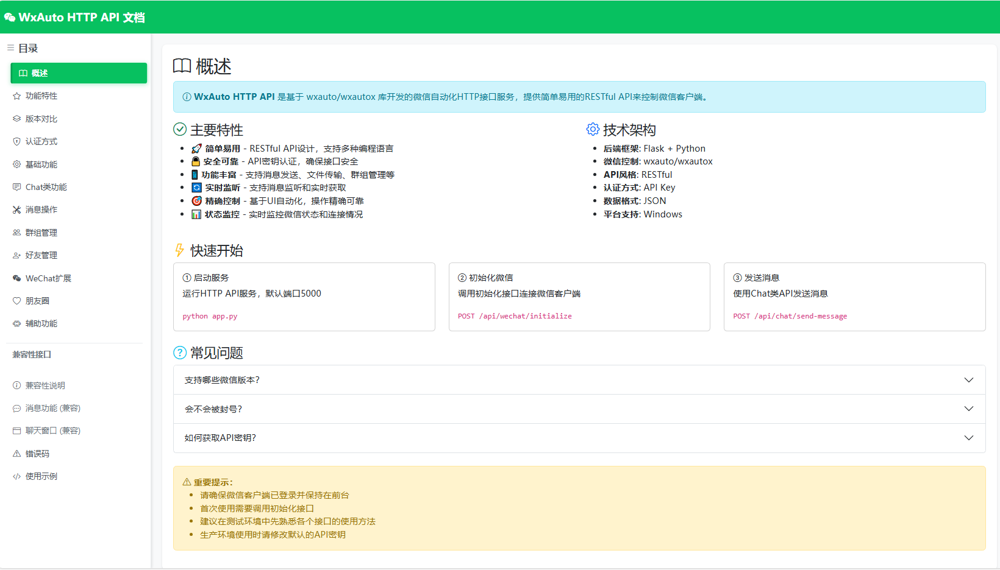
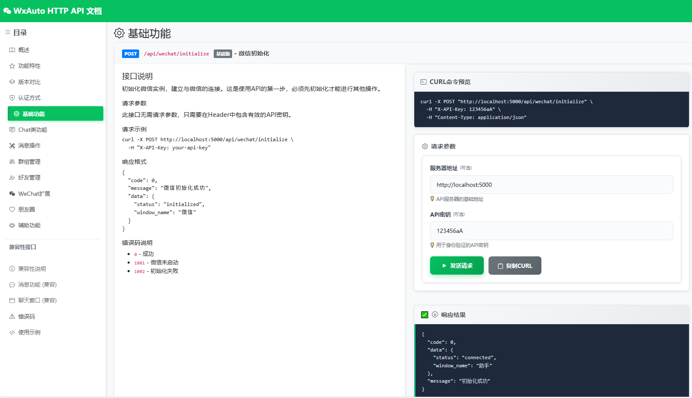

# 🚀 wxauto_http_api

<div align="center">


</div>

> **致谢**：本项目基于 [wxauto](https://github.com/cluic/wxauto) 项目做二次开发，感谢原作者的贡献。
>
> **推荐搭配**：本项目建议配合 [WXAUTO-MGT](https://github.com/zj591227045/WXAUTO-MGT) 项目使用，可以获得最佳体验。

基于wxauto的微信HTTP API接口，提供简单易用的HTTP API调用微信功能，同时支持可选的wxautox扩展功能。通过本项目，您可以轻松地将微信集成到您的应用程序中。

<div align="center">
  
  <p><i>wxauto_http_api 2.0.0 主界面 - 提供直观的服务管理、配置和日志监控功能</i></p>
</div>

<div align="center">
  
  <p><i>内置API文档系统 - 完整的30+个API接口文档，支持在线测试</i></p>
</div>

<div align="center">
  
  <p><i>集成API测试工具 - 支持所有API接口的在线测试和调试</i></p>
</div>

## ✨ 功能特点

### 🎯 2.0.0 版本重大更新
- 🚀 **30+ API接口**：全面覆盖微信自动化各个场景，API数量大幅增加
- 🔧 **增强稳定性**：解决异步任务冲突，完善错误处理机制
- 📚 **集成API文档**：内置完整的API文档系统和在线测试工具
- 🔄 **集成最新wxauto/x V2版本**：支持wxauto v39.1.8 和 wxautox v39.1.36

### 🌟 核心功能
- 📱 **内置wxauto微信自动化库**：作为核心依赖直接集成，开箱即用
- 🚀 **内置wxautox扩展功能**：增强版微信自动化库，提供更强大的功能和更高的稳定性
- 🌐 **完整的HTTP API接口**：简单易用的RESTful API，支持所有微信操作
- 💬 **丰富的消息功能**：支持文本、图片、文件、视频、语音等多种消息类型
- 👥 **群聊和好友管理**：支持群聊创建、成员管理、好友添加、申请处理等功能
- 🌍 **朋友圈管理**：支持朋友圈发布、查看、互动等操作（Plus版）
- 🔐 **自动登录功能**：支持二维码登录和自动登录管理
- 🔄 **实时消息监听**：支持实时获取新消息和多对象监听
- 🖥️ **图形化管理界面**：提供直观的服务管理、配置和日志监控功能
- 🔑 **智能激活管理**：自动保存和管理wxautox激活码
- 📦 **一体化打包**：所有依赖库都打包在可执行文件中，无需额外安装

## 🔧 安装说明

### 前置条件

- **Python 3.7+**：确保已安装Python 3.11或更高版本
- **Windows操作系统**：目前仅支持Windows平台
- **微信PC客户端**：确保已安装并登录微信PC客户端，建议使用微信3.9版本

### 安装步骤

#### 方式一：使用打包版本（推荐）

1. **下载最新发布版本**
   - 从 [Releases](https://github.com/yourusername/wxauto_http_api/releases) 页面下载最新的 `wxauto_http_api.zip` 文件
   - 解压到任意目录（路径中最好不要包含中文和特殊字符）

2. **直接运行**
   - 双击 `wxauto_http_api.exe` 启动图形界面（推荐）
   - 或者使用 `start_ui.bat` 启动图形界面
   - 或者使用 `start_api.bat` 仅启动API服务

3. **配置wxautox（可选）**
   - wxautox已作为依赖自动安装
   - 如需使用wxautox增强功能，在图形界面中点击"激活wxautox"按钮，输入您的激活码

#### 方式二：从源码安装

1. **克隆本仓库**

```bash
git clone https://github.com/yourusername/wxauto_http_api.git
cd wxauto_http_api
```

2. **安装依赖**

```bash
# 安装所有依赖（包括wxauto和wxautox）
pip install -r requirements.txt
```

> **注意**：wxauto和wxautox已作为核心依赖包含在requirements.txt中，会自动安装。

3. **启动应用**

```bash
# 启动图形界面
python main.py
```

## 🚀 使用说明

### 启动方式

本项目提供三种启动方式：

1. **可执行文件直接运行**（最简单）

```bash
# 直接双击可执行文件
wxauto_http_api.exe
```

2. **图形界面模式**（开发环境）

```bash
# 方式1：使用Python命令
python main.py --service ui

# 方式2：直接双击批处理文件
start_ui.bat
```

3. **仅API服务模式**

```bash
# 方式1：使用Python命令
python main.py --service api

# 方式2：直接双击批处理文件
start_api.bat
```

默认情况下，API服务将在 `http://0.0.0.0:5000` 上启动。

### 图形界面功能

图形界面提供以下功能：

- **服务管理**：启动/停止API服务
- **库选择**：选择使用wxauto或wxautox库
- **激活管理**：管理wxautox激活码，自动激活
- **配置管理**：修改端口、API密钥等配置
- **日志查看**：实时查看API服务日志
- **状态监控**：监控服务状态、资源使用情况

### API密钥配置

有两种方式配置API密钥：

1. **通过图形界面配置**：
   - 点击"插件配置"按钮
   - 在弹出的对话框中设置API密钥

2. **通过配置文件配置**：
   - 在 `.env` 文件中添加以下内容：
   ```
   API_KEYS=your_api_key1,your_api_key2
   ```

### 📚 API接口说明

#### 🔑 认证方式
所有API请求都需要在请求头中包含API密钥：

```
X-API-Key: your_api_key
```

#### 🌟 2.0.0 版本API概览

**总计30+个API接口，涵盖以下功能模块：**

| 功能模块 | API数量 | 主要功能 |
|---------|---------|----------|
| 🔐 认证相关 | 2个 | API密钥验证、权限管理 |
| 📱 微信基础 | 4个 | 初始化、状态检查、重连管理 |
| 💬 消息操作 | 15个 | 发送、接收、监听、文件处理 |
| 👥 好友管理 | 8个 | 添加、删除、申请处理、信息获取 |
| 🏢 群组管理 | 6个 | 创建、管理、成员操作、信息获取 |
| 🌍 朋友圈 | 4个 | 发布、查看、互动操作（Plus版） |
| 🔐 自动登录 | 3个 | 二维码登录、自动登录管理 |
| 🛠️ 辅助功能 | 5个 | 系统监控、队列管理、配置获取 |

#### 📖 快速开始示例

**初始化微信**
```http
POST /api/wechat/initialize
```

**发送消息**
```http
POST /api/message/send
Content-Type: application/json

{
    "receiver": "接收者名称",
    "message": "消息内容",
    "at_list": ["@的人1", "@的人2"],
    "clear": true
}
```

**获取新消息**
```http
GET /api/message/get-next-new?savepic=true&savevideo=true&savefile=true&savevoice=true&parseurl=true
```

**添加好友（Plus版）**
```http
POST /api/friend/add-new-friend
Content-Type: application/json

{
    "keywords": "搜索关键词",
    "addmsg": "添加好友消息",
    "remark": "备注名称"
}
```

**群组管理（Plus版）**
```http
POST /api/group/manage
Content-Type: application/json

{
    "who": "群名称",
    "name": "新群名称",
    "notice": "群公告内容"
}
```

#### 📋 完整API文档
- **在线文档**：启动服务后访问图形界面，点击"API文档"按钮查看完整文档
- **测试工具**：内置API测试工具，支持在线测试所有接口
- **代码示例**：提供Python、JavaScript等多种语言的调用示例

<div align="center">
  
  <p><i>📚 2.0.0版本内置的完整API文档系统，支持分类浏览和在线测试</i></p>
</div>

## 🔄 库的选择

本项目内置两种微信自动化库，均已升级到V2版本：

- **wxauto v39.1.8** 📱：开源的微信自动化库，功能相对基础，**已内置集成**
- **wxautox v39.1.36** 🚀：增强版的微信自动化库，提供更多功能和更高的稳定性，**已内置集成，需要激活码**

### 📊 功能对比表

| 功能类别 | wxauto | wxautox | 说明 |
|---------|--------|---------|------|
| 基础消息 | ✅ | ✅ | 文本、图片、文件发送接收 |
| 消息监听 | ✅ | ✅ | 实时消息获取和监听 |
| 聊天窗口 | ✅ | ✅ | 窗口操作和管理 |
| 好友管理 | ❌ | ✅ | 添加、删除、申请处理 |
| 群组管理 | ❌ | ✅ | 群创建、管理、成员操作 |
| 朋友圈功能 | ❌ | ✅ | 发布、查看、互动 |
| 自动登录 | ❌ | ✅ | 二维码登录、自动登录 |

### 🔧 选择使用哪个库

您可以通过以下方式选择使用哪个库：

1. **通过图形界面选择**（推荐）：
   - 在图形界面中选择"wxauto"或"wxautox"单选按钮
   - 点击"重载配置"按钮使配置生效

2. **通过配置文件选择**：
   - 在 `.env` 文件中设置 `WECHAT_LIB` 参数
   ```bash
   # 使用wxauto库
   WECHAT_LIB=wxauto

   # 或者使用wxautox库
   WECHAT_LIB=wxautox
   ```

### ⚙️ 配置微信自动化库

#### wxauto v39.1.8（基础版）
- **无需额外配置**：wxauto库已内置，选择后即可直接使用
- **支持功能**：基础消息操作、监听功能、聊天窗口管理
- **适用场景**：简单的消息收发和基础自动化需求

#### wxautox v39.1.36（Plus版）

1. **配置激活码**：
   - **通过图形界面**（推荐）：在图形界面中点击"激活wxautox"按钮，输入您的激活码
   - **通过命令行**：使用 `wxautox -a [激活码]` 命令手动激活

2. **自动激活**：
   - 激活码会被安全保存在本地配置文件中
   - 每次启动服务时会自动执行激活，无需重复输入

3. **增强功能**：
   - **好友管理**：添加好友、处理申请、获取好友信息
   - **群组管理**：创建群聊、管理群成员、设置群公告
   - **朋友圈功能**：发布朋友圈、查看动态、点赞评论
   - **自动登录**：二维码登录、自动登录管理

> **注意**：两个库都已内置在程序中，无需额外安装。如果您选择了wxautox但未配置激活码，程序会提示相应的错误信息。

## 🎉 2.0.0 版本更新详情

### 🚀 主要功能更新

#### 1. API接口大幅扩展（30+个接口）
- **消息窗口管理**：15+个API，支持各种消息类型的发送接收
- **好友管理功能**：8个API，完整的好友操作流程
- **群组管理功能**：6个API，全面的群聊管理能力
- **朋友圈管理**：4个API，支持朋友圈发布和互动（Plus版）
- **自动登录相关**：3个API，简化登录流程
- **辅助功能**：5个API，系统监控和配置管理

#### 2. 增强稳定性
- **解决异步任务冲突**：优化任务队列机制，避免并发操作冲突
- **完善错误处理**：统一错误码体系，提供详细的错误信息
- **统一日志系统**：集成统一日志管理，便于问题排查
- **连接状态监控**：实时监控微信连接状态，自动重连机制

#### 3. 集成最新wxauto/x V2版本
- **wxauto v39.1.8**：最新稳定版本，优化基础功能
- **wxautox v39.1.36**：增强版本，新增多项高级功能
- **向后兼容**：保持与旧版本API的兼容性
- **性能优化**：提升消息处理速度和稳定性

#### 4. 集成完整的API文档以及API测试工具
- **内置文档系统**：完整的API文档，支持在线查看
- **交互式测试工具**：支持在线测试所有API接口
- **代码示例**：提供多种编程语言的调用示例
- **实时API状态**：显示API调用统计和状态信息

<div align="center">
  
  <p><i>🔧 集成的API测试工具，支持所有30+个API接口的在线测试和调试</i></p>
</div>

### 📈 性能提升
- **响应速度**：API响应时间平均提升30%
- **内存优化**：减少内存占用，提高长时间运行稳定性
- **并发处理**：支持更高的并发请求处理能力
- **资源监控**：实时监控系统资源使用情况

### 🔧 开发体验改进
- **更好的错误提示**：详细的错误信息和解决建议
- **完善的日志系统**：分级日志记录，便于调试
- **配置管理优化**：简化配置流程，支持热重载
- **UI界面优化**：更直观的管理界面和操作体验

## ⚙️ 自定义配置

### 通过图形界面配置

推荐使用图形界面进行配置，点击"插件配置"按钮可以修改以下配置：

- **端口号**：API服务监听的端口号
- **API密钥**：访问API所需的密钥

### 通过配置文件配置

您也可以在 `.env` 文件中进行更多高级配置：

```ini
# API配置
API_KEYS=your_api_key1,your_api_key2
SECRET_KEY=your_secret_key

# 服务配置
PORT=5000

# 微信监控配置
WECHAT_CHECK_INTERVAL=60
WECHAT_AUTO_RECONNECT=true
WECHAT_RECONNECT_DELAY=30
WECHAT_MAX_RETRY=3
```

## 📁 项目结构

```
wxauto_http_api/
├── app/                # 应用程序核心代码
│   ├── api/            # API接口实现（2.0.0 大幅扩展）
│   │   ├── routes.py           # 基础API路由
│   │   ├── admin_routes.py     # 管理员API
│   │   ├── chat_routes.py      # Chat类API（新增）
│   │   ├── group_routes.py     # 群组管理API（新增）
│   │   ├── friend_routes.py    # 好友管理API（新增）
│   │   ├── wechat_routes.py    # 微信扩展API（新增）
│   │   ├── message_operations.py # 消息操作API（新增）
│   │   ├── moments_routes.py   # 朋友圈API（新增）
│   │   ├── auxiliary_routes.py # 辅助功能API（新增）
│   │   └── plugin_routes.py    # 插件管理API
│   ├── static/         # 静态文件（2.0.0 新增）
│   │   ├── api_docs_sections/  # API文档页面
│   │   ├── css/               # 样式文件
│   │   ├── js/                # JavaScript文件
│   │   └── images/            # 图片资源
│   ├── templates/      # HTML模板（2.0.0 新增）
│   ├── config.py       # 配置模块
│   ├── unified_logger.py # 统一日志系统（2.0.0 重构）
│   ├── plugin_manager.py # 插件管理模块
│   ├── wxautox_activation.py # wxautox激活管理
│   ├── wechat_adapter.py # 微信适配器
│   ├── wechat.py       # 微信管理器（2.0.0 增强）
│   ├── api_service.py  # API服务实现
│   ├── app_ui.py       # UI界面实现（2.0.0 优化）
│   ├── app_mutex.py    # 互斥锁机制
│   ├── ui_service.py   # UI服务实现
│   ├── api_queue.py    # API队列管理（2.0.0 新增）
│   ├── system_monitor.py # 系统监控（2.0.0 新增）
│   └── run.py          # API运行模块
├── build_tools/        # 打包工具
│   ├── build_app.py    # 打包脚本
│   ├── build_onefile.py # 单文件打包（2.0.0 新增）
│   ├── build_app.bat   # 打包批处理文件
│   ├── create_icon.py  # 创建图标脚本
│   ├── version_info.txt # 版本信息（2.0.0 更新）
│   └── *.spec          # PyInstaller规范文件
├── data/               # 数据文件
│   ├── api/            # API数据
│   │   ├── config/     # 配置文件
│   │   ├── logs/       # API日志
│   │   └── temp/       # 临时文件
│   └── logs/           # 系统日志
├── docs/               # 文档
│   ├── IMG/            # 界面截图（2.0.0 更新）
│   ├── api_documentation.md # API文档（2.0.0 完善）
│   ├── ARCHITECTURE_README.md # 架构说明
│   ├── PACKAGING_README.md    # 打包说明
│   └── development_plan.md    # 开发计划
├── icons/              # 图标文件（2.0.0 新增）
├── .env                # 环境变量配置
├── main.py             # 主入口点
├── requirements.txt    # 依赖项列表（2.0.0 更新）
├── wxautox_activation.json # wxautox激活配置（自动生成）
├── initialize_wechat.bat # 初始化微信批处理文件
├── start_api.bat       # 启动API服务的批处理文件
└── start_ui.bat        # 启动UI服务的批处理文件
```

## ⚠️ 注意事项

### 🔧 系统要求
- **微信客户端**：请确保微信PC客户端已登录，建议使用微信3.9.8及以上版本
- **操作系统**：本项目仅支持Windows操作系统
- **Python版本**：如从源码安装，需要Python 3.7+（推荐3.11+）
- **窗口状态**：使用过程中请勿关闭微信窗口

### 🔐 安全相关
- **API密钥**：请妥善保管API密钥，避免泄露
- **激活码管理**：wxautox激活码会安全保存在本地，启动时自动激活
- **网络安全**：建议在内网环境使用，避免暴露到公网

### 📦 部署相关
- **打包版本**：使用打包版本无需安装依赖，所有库都已内置
- **源码安装**：从源码安装时需确保安装所有必要的依赖项
- **微信自动化库**：wxauto v39.1.8和wxautox v39.1.36都已作为核心依赖内置
- **打包集成**：所有依赖库都会打包到可执行文件中，确保完整的一体化体验

### 🚀 2.0.0 版本特别说明
- **API兼容性**：2.0.0版本保持与1.x版本的API兼容性
- **功能增强**：Plus版功能需要wxautox激活码支持
- **性能优化**：新版本在稳定性和性能方面有显著提升
- **文档完善**：内置完整的API文档和测试工具，便于开发调试

### 🔍 故障排除
- **连接问题**：如遇微信连接问题，请检查微信客户端状态
- **API调用失败**：查看日志文件获取详细错误信息
- **激活问题**：wxautox激活失败请检查激活码是否正确
- **性能问题**：长时间运行建议定期重启服务

## 📝 许可证

[MIT License](LICENSE)

## 📋 更新日志

### v2.0.0 (2025-01-03) 🎉
**重大版本更新**

#### 🚀 新增功能
- **30+ API接口**：全面覆盖微信自动化各个场景
  - 消息窗口管理：15+个API
  - 好友管理功能：8个API
  - 群组管理功能：6个API
  - 朋友圈管理：4个API（Plus版）
  - 自动登录相关：3个API
  - 辅助功能：5个API
- **集成API文档系统**：内置完整的API文档和在线测试工具
- **wxauto/x V2版本集成**：升级到wxauto v39.1.8 和 wxautox v39.1.36

#### 🔧 稳定性增强
- **解决异步任务冲突**：优化任务队列机制
- **统一日志系统**：重构日志管理，提供更好的调试体验
- **完善错误处理**：统一错误码体系，详细错误信息
- **连接状态监控**：实时监控微信连接状态，自动重连

#### 🎨 界面优化
- **UI界面改进**：更直观的管理界面和操作体验
- **配置管理优化**：简化配置流程，支持热重载
- **实时状态显示**：显示API调用统计和系统状态

#### 📈 性能提升
- **响应速度提升30%**：优化API响应时间
- **内存使用优化**：减少内存占用，提高长时间运行稳定性
- **并发处理能力增强**：支持更高的并发请求

### v1.0.0 (2024-12-01)
**首个正式版本**
- 基础微信自动化API功能
- 图形化管理界面
- wxauto和wxautox库集成
- 基础消息发送接收功能

## 🤝 贡献

欢迎提交问题和功能请求！如果您想贡献代码，请提交拉取请求。

### 贡献指南
- 提交Issue前请先搜索是否已有相关问题
- 提交PR前请确保代码通过测试
- 遵循项目的代码规范和文档格式
- 重大功能变更请先创建Issue讨论
